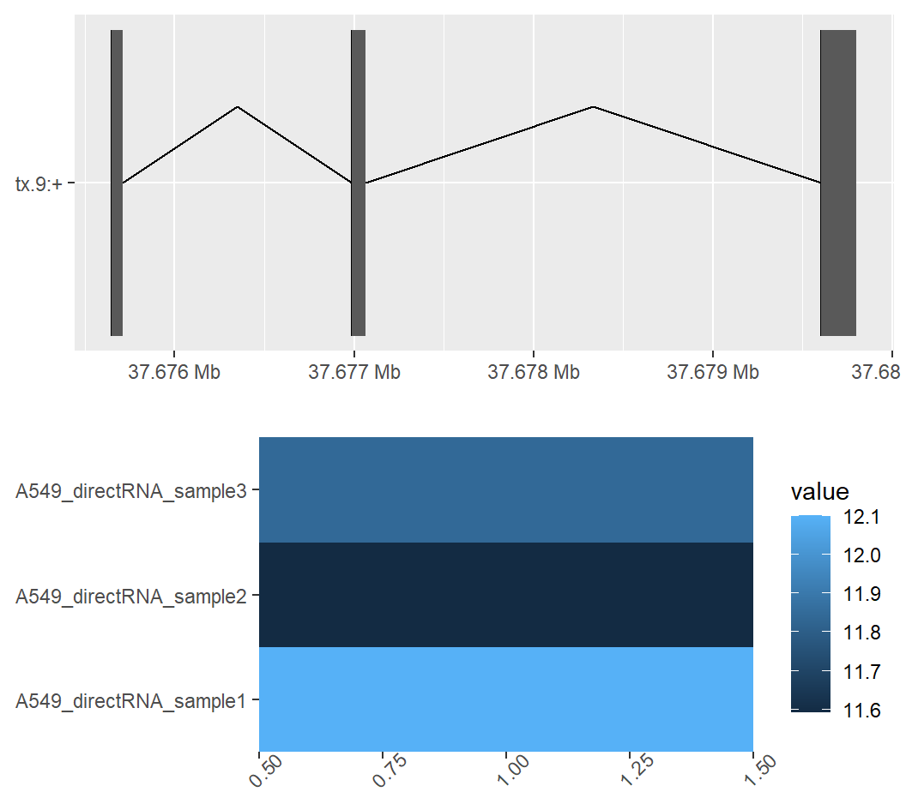
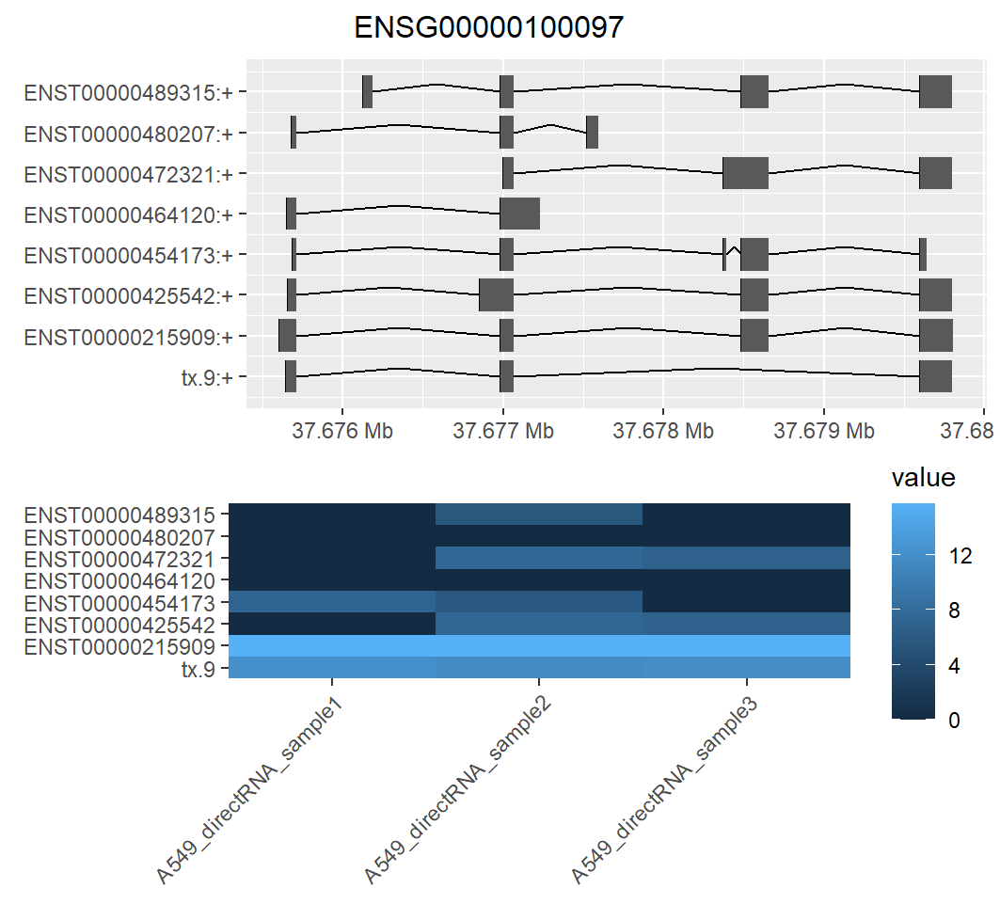
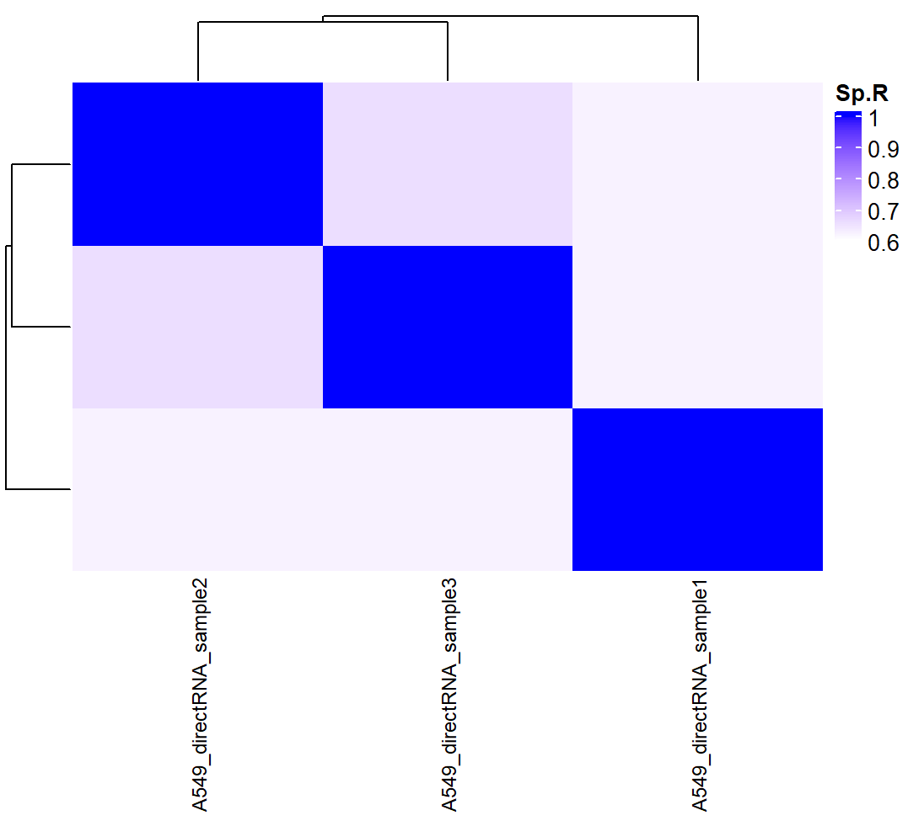
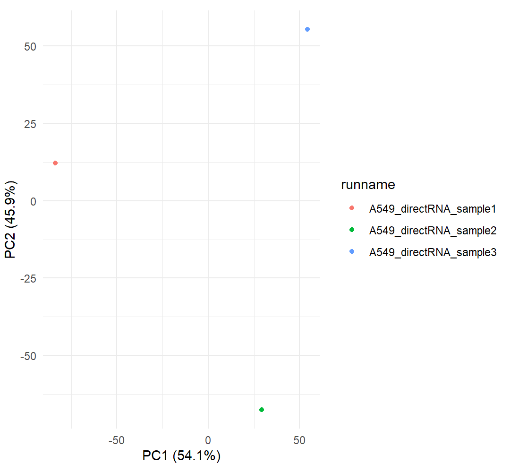

# bambu: Context-Aware Transcript Quantification from Long Read RNA-Seq data

[](https://www.tidyverse.org/lifecycle/#stable)
[](https://github.com/GoekeLab/bambu/graphs/contributors)
[](#installation)
[](https://github.com/goekelab/bambu/actions)  
[](https://github.com/goekelab/bambu/issues) 
[](https://github.com/goekelab/bambu/pulls) 
[](http://bioconductor.org/checkResults/release/bioc-LATEST/bambu/)
[](https://bioconductor.org/checkResults/devel/bioc-LATEST/bambu)
[](https://www.gnu.org/licenses/gpl-3.0)
[](https://www.codefactor.io/repository/github/goekelab/bambu)
[](https://codecov.io/gh/GoekeLab/bambu)


***bambu*** is a R package for multi-sample transcript discovery and quantification using long read RNA-Seq data. You can use ***bambu*** after read alignment to obtain expression estimates for known and novel transcripts and genes. The output from ***bambu*** can directly be used for visualization and downstream analysis such as differential gene expression or transcript usage.

### Content

- [Installation](#installation)
- [General Usage](#General-Usage)
  - [Using precalculated annotation objects](#Using-precalculated-annotation-objects)
  - [Running multiple samples](#Running-multiple-samples)
  - [Modulating the sensitivity of discovery (pre and post analysis)](#Modulating-the-sensitivity-of-discovery-pre-and-post-analysis)
  - [Output](#Output)
  - [Visualization](#Visualization)
- [*bambu* Advanced Options](#Bambu-Advanced-Options)
  - [Using a pretrained model](#Using-a-pretrained-model)
  - [De-novo transcript discovery](#De-novo-transcript-discovery)
  - [Storing and using preprocessed files (rcFiles)](#Storing-and-using-preprocessed-files-rcFiles)
  - [Tracking read-to-transcript assignment](#Tracking-read-to-transcript-assignment)
  - [Training a model on another species/dataset and applying it](#Training-a-model-on-another-speciesdataset-and-applying-it)
  - [Quantification of gene expression](#Quantification-of-gene-expression)
  - [Including single exons](#Including-single-exons)
  - [*bambu* Arguments](#Bambu-Arguments)
  - [Output Description](#Output-Description)
- [Release History](#Release-History)
- [Citation](#Citation)
- [Contributors](#Contributors)

### Installation

*bambu* is available through GitHub and Bioconductor

Bioconductor:
```rscript
if (!requireNamespace("BiocManager", quietly = TRUE)) install.packages("BiocManager")
BiocManager::install("bambu")
```

GitHub:
```rscript
library(devtools)
install_github("GoekeLab/bambu")
library(bambu)
```
We can test if *bambu* is installed correctly and runs correctly by using a small test set that comes with the package. 

```rscript
test.bam <- system.file("extdata", "SGNex_A549_directRNA_replicate5_run1_chr9_1_1000000.bam", package = "bambu")
fa.file <- system.file("extdata", "Homo_sapiens.GRCh38.dna_sm.primary_assembly_chr9_1_1000000.fa", package = "bambu")

gtf.file <- system.file("extdata", "Homo_sapiens.GRCh38.91_chr9_1_1000000.gtf", package = "bambu")

bambuAnnotations <- prepareAnnotations(gtf.file)

se <- bambu(reads = test.bam, annotations = bambuAnnotations, genome = fa.file)

```


### General Usage
The default mode to run *bambu* is using a set of aligned reads (bam files), reference genome annotations (gtf file, TxDb object, or bambuAnnotation object that can be obtained from prepareAnnotations() function), and reference genome sequence (fasta file or BSgenome). bambu will return a summarizedExperiment object with the genomic coordinates for annotated and new transcripts and transcript expression estimates.
If you do not have any data yet or would like to test *bambu* with a full data-set that has been proven to work (the test data-set that comes with the package is too small to do proper analysis on), we recommend the SG-NEx data project. You can find this data and instructions on how to install it at [here](https://github.com/GoekeLab/sg-nex-data/blob/master/docs/SG-NEx_Bambu_tutorial.md).
We highly recommend using the same annotations that were used for genome alignment. If you have a gtf file and fasta file you can run bambu with the following options:
```rscript
se <- bambu(reads = sample, annotations = annotations, genome = fa.file)
```
**reads** -  is a path to one or more bam files aligned to the same genome used in the genome argument, or a path to intermediate read class files (see [Storing and using preprocessed files (rcFiles)](#Storing-and-using-preprocessed-files-rcFiles))

**genome** - is a path to the genome fasta file. This should be the same file used for read alignment. *Bambu* does not support alignment to the transcriptome as it requires the splice junctions from a genome alignment for transcript discovery.

**annotations** - takes a path to a gtf file, a txdb object, or annotations prepared by prepareAnnotations() (see  [Use precalculated annotation objects](#Use-precalculated-annotation-objects)). When not provided, de novo transcript discovery is performed (see [De-novo transcript discovery](#De-novo-transcript-discovery))

**NDR** - Novel Discovery Rate threshold. A value between 0 and 1 representing the maximum NDR threshold for candidate transcripts to be included in the analysis. By default, *bambu* will recommend a threshold for your analysis. For more information see [Modulating the sensitivity of discovery (pre and post analysis)](#Modulating-the-sensitivity-of-discovery-pre-and-post-analysis).

For the full parameter list see [Arguments](#Arguments)

For information on the output and how to export it to a file see [Output](#Output).

#### **Transcript discovery only (no quantification)**

If you are only interested in identifying novel transcripts, the quantification module of *bambu* can be skipped by setting quant to FALSE. 
Note that the output will be a GRangeslist object containing the reference and novel annotations (See rowRanges() in [Output](#Output)). We recommend running transcript discovery only mode with NDR = 1, and doing filtering in the downstream analysis to allow flexibility in the analysis. See [Modulating the sensitivity of discovery (pre and post analysis)](#Modulating-the-sensitivity-of-discovery-pre-and-post-analysis)

```rscript
se.discoveryOnly <- bambu(reads = test.bam, annotations = gtf.file, genome = fa.file, quant = FALSE)
```

**Quantification of annotated transcripts and genes only (no transcript/gene discovery)**

If you are only interested in quantifying transcripts, the discovery module of *bambu* can be skipped by setting discovery to FALSE.

```rscript
se.quantOnly <- bambu(reads = test.bam, annotations = gtf.file, genome = fa.file, discovery = FALSE)
```
### Using precalculated annotation objects
Depending on the size of your reference annotations the prepareAnnotations() step may take a few minutes. You can also use precalculated annotations and if you plan to run *bambu* more frequently with the same annotations, we recommend to save the bambuAnnotations object.
The bambuAnnotation object can be calculated from:

a) a .gtf file:
```rscript
annotations <- prepareAnnotation(gtf.file)
```
b) a TxDb object
```rscript
annotations <- prepareAnnotations(txdb)
```
Save the object
```rscript
saveRDS(annotations, ”/path/to/annotations.rds” )
```
This object can then be used instead of a path to your reference annotations to the annotations argument.
```rscript
annotations <- readRDS("/path/to/annotations.rds")
bambu(reads <- test.bam, annotations = annotations, genome = fa.file)
```
### Running multiple samples

If you have multiple replicates for a sample, or plan to do comparative analysis between conditions, it may be beneficial to run all samples together instead of individually. This can be done by providing a vector of paths to all the bam files you want to analyze together.

```rscript

se.multiSample <- bambu(reads = c(test1.bam, test2.bam, test3.bam), annotations = gtf.file, genome = fa.file)
```

The advantage of running samples together include:
Novel transcripts that are identified in multiple samples are assigned unified IDs, enabling comparative analysis between different samples. This is especially important for downstream differential expression analysis when looking at novel transcripts. Running multiple samples can be multithreaded (see [ncore](#bambu-arguments)). While running multiple samples, By default, *bambu* will train a model separately on each sample and score novel transcripts in each sample separately.

If you need to combine samples in multiple configurations (for example different pairwise comparisons) we would recommend using the intermediate rcFiles to save processing time (see [Storing and using preprocessed files (rcFiles)](#Storing-and-using-preprocessed-files-rcFiles))
 
### Modulating the sensitivity of discovery (pre and post analysis)

When doing transcript discovery there is a balance between sensitivity (the number of real novel transcripts that are detected) and the precision (how many of the novel transcripts are real). To control this balance, *bambu* uses the novel discovery rate (NDR) as the main parameter. The NDR threshold approximates the proportion of novel candidates output by bambu, relative to the number of known transcripts it found, i.e., an NDR of 0.1 would mean that 10% of all transcripts passing the threshold are classified as novel. 

If you are using a genome where you expect a high amount of novel transcripts, a higher NDR is recommended so that these novel transcripts are not missed. Conversely if you are using a well annotated genome, we recommend a lower NDR threshold to reduce the presence of false positives. By default the NDR threshold is automatically chosen for the user based on predicted level of annotation completeness when compared to the default model trained on human reference annotations (Hg38). For more information see [Training a model on another species/dataset and applying it](#Training-a-model-on-another-speciesdataset-and-applying-it)

To manually select an NDR value, use the NDR argument in *bambu*:

```rscript
se.NDR_0.3 <- bambu(reads = test.bam, annotations = annotations, genome = fa.file, NDR = 0.3)
```
Alternatively transcript discovery can be run without thresholds, producing a GRangesList annotation object with all transcripts scored with its NDR score. Note that this means turning quant = FALSE in running *bambu* (refer to [“Transcript discovery only”](#transcript-discovery-only-no-quantification) section). The annotations can be filtered by their NDR score (see example below), read count and gene read proportion between the discovery and quantification steps or used for other types of analysis. 

```rscript
newAnnotations <- bambu(reads = test.bam, annotations = annotations, genome = fa.file, NDR = 1, quant = FALSE)
annotations.filtered <- newAnnotations[(!is.na(mcols(newAnnotations)$NDR) & mcols(newAnnotations)$NDR<0.1) | is.na(mcols(newAnnotations)$NDR)]
se.NDR_1 <- bambu(reads = test.bam, annotations = annotations.filtered, genome = fa.file, NDR = 1, discovery = FALSE)
```
Additionally there are other thresholds that advanced users can access through opt.discovery when running *bambu* (see arguments).

### Output
*bambu* returns a SummarizedExperiment object which can be accessed as follows:

- **assays(se)** returns a list of transcript abundance estimates as counts or CPM
- **rowRanges(se)** returns a GRangesList with all annotated and newly discovered transcripts
- **rowData(se)** returns additional information about each transcript

Access transcript expression estimates by extracting a variable (such as counts or CPM) using assays(): 

- **assays(se)$counts** - expression estimates
- **assays(se)$CPM** - sequencing depth normalized estimates
- **assays(se)$fullLengthCounts** - estimates of read counts mapped as full length reads for each transcript
- **assays(se)$uniqueCounts** - counts of reads that are uniquely mapped to each transcript


For a full description of the other outputs see [Output Description](#Output-Description)

The full output can be written to a file using writeBambuOutput().  Using this function will generate three files, including a .gtf file for the extended annotations, and two .txt files for the expression counts at transcript and gene levels.
```rscript
writeBambuOutput(se, path = "./bambu/")
```
If you are only interested in the novel transcripts, one can filter this 'se' object first to remove reference annotations.
```rscript
se.novel = se[mcols(se)$novelTranscript,]
writeBambuOutput(se.novel, path = "./bambu/")
```
If you are only interested in full-length transcripts that were detected by Bambu.
```rscript
se.novel = se[assays(se)$fullLengthCounts >= 1,]
writeBambuOutput(se.novel, path = "./bambu/")
```

If quant is set to FALSE i.e. only transcript discovery is performed, only the rowRanges output of the extended annotations is returned (a GRangesList object). The equivalent rowData can be accessed with mcols()
These annotations can be written to a .gtf file using writeToGTF(GRangesList_object, output_path).
```rscript
se.discoveryOnly <- bambu(reads = sample, annotations = annotations, genome = fa.file, quant = FALSE)
writeToGTF(se.discoveryOnly, "./output.gtf")
```
As above, to output only the novel annotations, you need to filter out the reference annotations.
```rscript
se.discoveryOnly.novel = se.discoveryOnly[mcols(se.discoveryOnly)$novelTranscript,]
writeToGTF(se.discoveryOnly.novel, "./output.gtf")
```
If you are only interested in full-length transcripts that were detected by Bambu. If multiple transcripts share exon-junctions, only one will be displayed. To avoid this, do the filter after quantification as in the example above.
```rscript
se.novel = se[!is.na(mcols(se)$readCount) & mcols(se)$readCount >= 1,]
writeBambuOutput(se.novel, path = "./bambu/")
```

If both quant and discovery are set to FALSE, *bambu* will return an intermediate object see [Storing and using preprocessed files (rcFiles)](#Storing-and-using-preprocessed-files-rcFiles)


### Visualization
You can visualize the novel genes/transcripts using plotBambu function. (Note that the visualization was done by running *bambu* on the three replicates of HepG2 cell line in the SG-NEx project)

```rscript
plotBambu(se, type = "annotation", gene_id = "ENSG00000107104")
```

<p align="center">

</p>

```rscript
plotBambu(se, type = "annotation", transcript_id = "tx.9")
```

<p align="center">

</p>

plotBambu can also be used to visualize the clustering of input samples on gene/transcript expressions. Only for multiple samples’ visualisation. See [Running multiple samples](#Running-multiple-samples)

```rscript
plotBambu(se, type = "heatmap") # heatmap 
```

<p align="center">

</p>

```rscript
plotBambu(se, type = "pca") # PCA visualization
```

<p align="center">

</p>

plotBambu can also be used to visualize the clustering of input samples on gene/transcript expressions with grouping variable
```rscript
plotBambu(se, type = "heatmap", group.var) # heatmap 

plotBambu(se, type = "pca", group.var) # PCA visualization
```

### *Bambu* Advanced Options
Below we include several advanced options and use-cases for *bambu*. We recommend reading and understanding the [paper](https://www.biorxiv.org/content/10.1101/2022.11.14.516358v1) before attempting to use these features.

### Using a pretrained model

*Bambu* requires at least 1000 transcripts from the annotations to be detected in a sample in order to train a sample specific model. In use cases where this is not possible *bambu* will instead use a default pretrained model to calculate the transcript probability score (TPS) for each read class. Users can force this behavior if they believe their annotations are not sufficient for sample specific training (for example if they suspect a high proportion of real novel transcripts are present in their sample). This is advantageous when you want NDR calibration without the impacts of a model trained using low quality annotations. 

```rscript
se <- bambu(reads = test.bam, annotations = annotations, genome = fa.file, opt.discovery = list(fitReadClassModel = FALSE))
```
The default pretrained model was trained on SGNex_HepG2_directRNA_replicate5_run1 and has the following characteristics:

Genome: Homo_sapiens.GRCh38.dna_sm.primary_assembly <br>
Annotations: Homo_sapiens.GRCh38.91<br>
Read count:  7,861,846<br>
Technology: Nanopore (ONT)<br>
Library preparation: directRNA<br>
Base Calling Accuracy: 79%<br>
Average Read Length: 1093<br>

We have found the pretrained model works successfully across species borders (on Arabidopsis thaliana) and on different technologies (PacBio), with only small decreases in performance compared to using a sample specific model. The pretrained model is not always effective in samples with large differences in sequencing quality or if the library preparation results in biases in the overall structure of the transcriptome. In this case, we would recommend training a new model using similar data from a different sample that has quality reference annotations (See [Training a model on another species/dataset and applying it](#Training-a-model-on-another-speciesdataset-and-applying-it)).

### De-novo transcript discovery

In cases where the organism does not yet have reference annotations, or unreliable annotations, *bambu* can be run in de-novo mode. In de-novo mode, *bambu* does not train a model, and instead uses the pretrained model to classify novel transcripts (see [Using a pretrained model](#Using-a-pretrained-model). To learn how to train a new model for a more closely related organism/sample see [Training a model on another species/dataset and applying it](#Training-a-model-on-another-speciesdataset-and-applying-it). Without annotations *bambu* is unable to calibrate the NDR output, nor be able to recommend a threshold and will instead use the TPS as the thresholded value. Therefore you should supply a manual NDR threshold ([Modulating the sensitivity of discovery (pre and post analysis)](#Modulating-the-sensitivity-of-discovery-pre-and-post-analysis)) and note that the precision of the output is unlikely to linearly match an applied threshold.
The TPS threshold used is (> 1-NDR). If an NDR is not provided, a default NDR threshold of <0.1 is used (an effective TPS threshold of > 0.9). As in  [Modulating the sensitivity of discovery (pre and post analysis)](#Modulating-the-sensitivity-of-discovery-pre-and-post-analysis) an NDR of 1 can be provided to output all possible read classes with their TPS scores 

```rscript
novelAnnotations <- bambu(reads = test.bam, annotations = NULL, genome = fa.file, NDR = 0.5, quant = FALSE)
```
### Storing and using preprocessed files (rcFiles)

The first step of *bambu* involves the construction of read classes which is a large fraction of the running time. This could be time-consuming if we want to perform transcript discovery & quantification multiple times on the same dataset using different configurations (eg. NDR, or combinations of samples), especially when the sample is large. To mitigate this, we can store the read class information as read class files (rcFiles) during a *bambu* run. Then they can be used as an input argument in the  *bambu* main function for the subsequent *bambu* run.

```rscript 
se <- bambu(reads = rcFiles, annotations = annotations, genome = fa.file)
```
rcFiles can be generated in two ways, either as a direct output of the bambu() function when quant and discovery are FALSE, or as written outputs when a path is provided to the rcOutdir argument. When rcFiles are output using rcOutdir this is done using BiocFileCache. For more details on how to access, use, and identify these files see [here](https://bioconductor.org/packages/release/bioc/html/BiocFileCache.html). A short example is shown below.

Example using rcOutDir to produce preprocessed files
```rscript
se <- bambu(reads = test.bam, rcOutDir = "path/to/rcOutput/", annotations = annotations, genome = fa.file)
```

This will store a preprocessed rcFile in the provided directory for each sample file provided to reads. To access these files for future use, we recommend using the BioCFileCache package which provides the metadata needed to identify the sample.

```rscript
library(BiocFileCache)
bfc <- BiocFileCache("path/to/rcOutput/", ask = FALSE)
info <- bfcinfo(bfc)
```
The info object is a tibble which associates the filename (fpath) with the sample (rname) to help you identify which .rds file you need.

```rscript
info
# running bambu using the first file
se <- bambu(reads = info$rpath[1], annotations = annotations, genome = fa.file)
```

This output is also generated when both quant and discovery are set to false in a list form indexed by sample.
```rscript
se <- bambu(reads = test.bam, annotations = annotations, genome = fa.file, discovery = FALSE, quant = FALSE)
```

As this is an intermediate object it will not be suitable to use for general use cases. We will document the object below for any potential advanced use cases that may arise.
```rscript
rowData(se[[1]])
```

|column name|description|
|---|---|
|chr.rc|The chromosome name the read class is found on|
|strand.rc|The strand of the read class|
|startSD|The standard deviation of the aligned genomic start positions of all reads assigned to the read class|
|readCount.posStrand|The number of reads assigned to this read class that aligned to the positive strand|
|intronStarts|A comma separated character vector of intron start coordinates|
|intronEnds|A comma separated character vector of intron end coordinates|
|confidenceType|Category of confidence: <br> **highConfidenceJunctionReads** - the read class contain no low confidence junctions <br> **lowConfidenceJunctionReads** - the read class contains low confidence junctions <br> **unsplicedWithin** - single exon read class that is within the exon boundaries of an annotation <br> **unsplicedNew** - single exon read class that does not fully overlap with annotated exons|
|readCount|The number of reads assigned to this read class|
|readId *only present when trackReads = TRUE|An integer list of bambu internal read ids that belong to the read class. (See the metadata of the object for full read names)|
|GENEID|The gene ID the transcript is associated with|
|novelGene|A logical that is true if the read class belongs to a novel gene (does not overlap with an annotated gene loci)|
|numExons|The number of exons the read class has|
|geneReadProp|The proportion of reads assigned to this read class relative to all the reads assigned to all read classes from its gene|
|geneReadCount|The number of reads assigned to the gene of this read class|
|equal|A logical that is true if the read classes exon-junctions perfectly and completely match the exon-junctions of a reference annotation|
|compatible|An integer counting the number of reference annotations, where the read classes exon-junctions are contiguously present (a subset)|
|numAstart|An integer counting the number of A nucleotides found within a 20bp window centered on the read class genomic start position|
|numAend|An integer counting the number of A nucleotides found within a 20bp window centered on the read class genomic end position|
|numTstart|An integer counting the number of T nucleotides found within a 20bp window centered on the read class genomic start position|
|numTend|An integer counting the number of T nucleotides found within a 20bp window centered on the read class genomic end position|
|txScore|This is the TPS generated by the sample trained model|
|txScore.noFit|This is the TPS generated by the pretrained model|


### Tracking read-to-transcript assignment

Some use cases require knowing which individual reads support specific transcripts (novel and annotated). By default this feature is off due to the memory overhead it introduces but can be turned on using the trackReads argument. The output has three columns: read_id, a list of indices of equal matches, a list of indices of compatible matches.  These indices match the annotations found in rowRanges(se)

```rscript
se <- bambu(reads = test.bam, annotations = annotations, genome = fa.file, trackReads = TRUE)
metadata(se)$readToTranscriptMaps[[1]]
```

|column name|description|
|---|---|
|readId|The read name as found in the bam file. If running from a rcFile where trackReads!=TRUE, bambu will not have stored the read names, this will instead be a unique bambu-assigned numerical ID (will not correlate with the bam file). |
|equalMatches|A list of integers with the tx ids where the exon-junctions of the read match completely and contiguously. This matches the index of the transcript found in rowRanges()|
|compatibleMatches|A list of integers with the tx ids where the exon-junctions of the read are found contiguously within the transcript (a subset). This matches the index of the transcript found in rowRanges()|


### Training a model on another species/dataset and applying it

In situations where training is not or cannot be performed, and the default model is also not suitable for the sample (the sample is generated from a different technology, species, condition, etc), *bambu* provides the option to train a new model, if well annotated similar data is available. For example one might train a model on arabidopsis to apply to an unannotated plant sample.

```rscript
# first train the model using a related annotated dataset from .bam
se = bambu(reads = sample1.bam, annotations = annotations, genome = fa.file, discovery = FALSE, quant = FALSE, opt.discovery = list(returnModel = TRUE)) # note that discovery and quant need to be set to FALSE, alternatively you can have them set to TRUE and retrieve the model from the rcFile as long as returnModel = TRUE ([see here](#Storing-and-using-preprocessed-files-rcFiles)).
newDefaultModel = metadata(se[[1]])$model # [[1]] will select the model trained on the first sample

# alternatively train the model using an rcFile
rcFile <- readRDS(pathToRcFile)
newDefaultModel = trainBambu(rcFile)

# use the trained model on another sample
# sample2.bam and fa.file2 represent the aligned reads and genome for the poorly annotated sample
se <- bambu(reads = sample2.bam, annotations = NULL, genome = fa.file2, opt.discovery = list(defaultModels = newDefaultModel, fitReadClassModel = FALSE))

#trainBambu Arguments

rcFile <- NULL, min.readCount = 2, nrounds = 50, NDR.threshold = 0.1, verbose = TRUE
```

|arguments|description|
|---|---|
|rcFile|A loaded rcFile sample (see [Storing and using preprocessed files (rcFiles)](#Storing-and-using-preprocessed-files-rcFiles))|
|min.readCount|The minimum read count threshold used for read classes during training|
|nrounds|The number of stumps used in the xgboost tree|
|NDR.threshold|The NDR threshold that will be used for the recommended NDR calibration when using this model. |
|verbose|A logical if more information should be printed whilst the function is running|


### Quantification of gene expression

To obtain gene expression, simply summing up over all annotated transcripts will likely underestimate it, as Bambu assigns only reads to transcripts if they are compatible. Reads which are incompatible with transcripts, but which can be assigned to the gene are tracked by Bambu to obtain more accurate gene expression estimate.

To obtain the accurate gene expression estimates which uses all reads that can be assigned to each gene (including reads that are incompatible with all existing annotations) you can run the following command:
```rscript
seGene <- transcriptToGeneExpression(se)
```
The output of this function is a *SummarizedExperiment* object, where

- assays(seGene)$counts  returns the estimated expression counts for each gene
- assays(seGene)$CPM returns the estimated CPM for each gene
- rowData(seGene) returns the gene information
- rowRanges(seGene) returns the gene genomic ranges 


### Including single exons

By default *bambu* does not report single exon transcripts because they are known to have a high frequency of false positives and do not have splice junctions that are used by *bambu* to distinguish read classes. Nevertheless *bambu* trains a separate model on single-exon transcripts, and these predictions can be accessed and included in the annotations.

```rscript
se <- bambu(reads = sample1.bam, annotations = annotations, genome = fa.file, opt.discovery = list(min.txScore.singleExon = 0))
```

### *Bambu* Arguments

|argument|description|
|---|---|
|reads|A string or a vector of strings specifying the paths of bam files for genomic alignments, or a BamFile object or a BamFileList object (from Rsamtools).|
| rcOutDir | A string variable specifying the path to where read class files will be saved. |
| annotations | A TxDb object, a path to a .gtf file, or a GRangesList object obtained by prepareAnnotations. |
| genome | A fasta file or a BSGenome object. |
| stranded | A boolean for strandedness, defaults to FALSE. |
| ncore | specifying number of cores used when parallel processing is used, defaults to 1. |
| NDR | specifying the maximum NDR rate to novel transcript output among detected transcripts, defaults to 0.1 |
| yieldSize | see Rsamtools. |
| opt.discovery | A list of controlling parameters for isoform reconstruction process:  <br> **prefix** specifying prefix for new gene Ids (genePrefix.number), defaults to empty <br> **remove.subsetTx** indicating whether filter to remove read classes which are a subset of known transcripts, defaults to TRUE <br> **min.readCount** specifying minimun read count to consider a read class valid in a sample, defaults to 2 <br> **min.readFractionByGene** specifying minimum relative read count per gene, highly expressed genes will have many high read count low relative abundance transcripts that can be filtered, defaults to 0.05 <br> **min.sampleNumber** specifying minimum sample number with minimum read count, gene read proportion, and TPS, defaults to 1 <br> **min.exonDistance** specifying minimum distance to known transcript to be considered valid as new, defaults to 35bp <br> **min.exonOverlap** specifying minimum number of bases shared with annotation to be assigned to the same gene id, defaults to 10bp <br> **min.primarySecondaryDist** specifying the minimum number of distance threshold between a read class and the annotations internal exons. Read classes with distances less than the threshold are not annotated as novel and counted with the annotations for quantification, defaults to 5bp <br> **min.primarySecondaryDistStartEnd1** specifying the minimum number of distance threshold between a read class and the annotations start/end exons. Read classes with distances less than the threshold are not annotated as novel, defaults to 5bp <br> **min.primarySecondaryDistStartEnd2** specifying the minimum number of distance threshold between a read class and the annotations start/end exons. Read classes with distances less than the threshold are counted with the annotations, defaults to 5bp <br> **min.txScore.multiExon** specifying the minimum transcript probility score threshold for multi-exon transcripts for min.sampleNumber, defaults to 0 <br> **min.txScore.singleExon** specifying the minimum transcript probability score threshold for single-exon transcripts for min.sampleNumber <br> **fitReadClassModel** a boolean specifying if bambu should train a model on each sample. If set to false bambu will use the default model for ranking novel transcripts. defaults to TRUE <br> **defaultModels** a bambu trained model object that bambu will use when fitReadClassModel==FALSE or the data is not suitable for training, defaults to the pretrained model in the *bambu* package <br> **returnModel** a boolean specifying if bambu will output the model it trained on the data, defaults to FALSE <br> **baselineFDR** a value between 0-1. Bambu uses this FDR on the trained model to recommend an equivilent NDR threshold to be used for the sample. By default, a baseline FDR of 0.1 is used. This does not impact the analysis if an NDR is set. <br> **min.readFractionByEqClass** indicating the minimum relative read count of a subset transcript compared to all superset transcripts (ie the relative read count within the minimum equivalent class). This filter is applied on the set of annotations across all samples using the total read count, this is not a per-sample filter. Please use with  caution. defaults to 0 |
| opt.em | A list of controlling parameters for quantification algorithm estimation process: <br> **maxiter** specifying maximum number of run iterations, defaults to 10000 <br> **degradationBias** correcting for degradation bias, defaults to TRUE <br> **conv** specifying the covergence threshold control, defaults to 0.0001 <br> **minvalue** specifying the minvalue for convergence consideration, defaults to 0.00000001 |
| trackReads | When TRUE read names will be tracked and output as metadata in the final output as readToTranscriptMaps detailing the assignment of reads to transcripts.The output is a list with an entry for each sample. |
| returnDistTable | When TRUE the calculated distance table between read classes and annotations will be output as metadata as distTables. The output is a list with an entry for each sample. |
| discovery | A logical variable indicating whether annotations are to be extended for quantification, defaults to TRUE. |
| quant | A logical variable indicating whether quantification will be performed, defaults to TRUE. |
| verbose | A logical variable indicating whether processing messages will be printed. |
| lowMemory | Reads will be processed by chromosomes instead of all together when lowMemory is specified. This option provides an efficient way to process big samples. |

### Output Description
Access annotations that are matched to the transcript expression estimates by rowRanges()
```rscript
rowRanges(se)
```
|column|description|
|---|---|
|seqnames|The scaffold name the transcript is found on|
|ranges|An iRanges object containing the start and end coordinates of the transcript (not stranded)|
|strand|The strand of the transcript (+, -, *)|
|exon_rank|The exon index of the exons in the transcript starting from the 5’ end of the transcript|
|exon_endRank|The exon index of the exons in the transcript starting from the 3’ end of the transcript|

 
Access transcript level data which is matched to transcript expression estimates using rowData()
```rscript
mcols(rowRanges(se)) 
#or
mcols(se) 
#or 
rowData(se)
```

|column|description| 
|---|---|
|TXNAME|The transcript name for the transcript. Will use either the transcript name from the provided annotations or tx.X if it is a novel transcript where X is a unique integer.|
|GENEID|The gene name for the transcript. Will use either the gene name from the provided annotations or gene.X if it is a novel transcript where X is a unique integer.| 
|eqClass|A character vector with the transcript names of all the equivalent transcripts (those which have this transcripts contiguous exon junctions)|
|txId|A bambu specific transcript id used for indexing purposes
|eqClassById|A integer list with the transcript ids of all equivalent transcripts
|txClassDescription|A concatenated string containing the classes the transcript falls under: <br> **annotation** - Transcript matches an annotation transcript <br> **allNew** - All the intron-junctions are novel <br> **newFirstJunction** - the first junction is novel and at least one other junction matches an annotated transcript <br> **newLastJunction** - the last junction is novel and at least one other junction matches an annotated transcript <br> **newJunction** - an internal junction is novel and at least one other internal junction matches an annotated transcript <br> **newWithin** -  A novel transcript with matching junctions but is not a subset of an annotation <br> **unsplicedNew** - A single exon transcript that doesn’t completely overlap with annotations <br> **compatible** - Is a subset of an annotated transcript <br> **newFirstExon** - The first exon is novel <br> **newLastExon** - The last exon is novel|
|readCount|The number of full length reads associated with this transcript (filtered by min.readCount)|
|NDR|The NDR score calculated for the transcript|
|relReadCount|The proportion of reads this transcript has relative to all reads assigned to its gene|
|relSubsetCount|The proportion of reads this transcript has relative to all reads that either fully or partially match this transcript|

 

### Release History

**bambu version 3.0.0**
Release date: 2022-10-25
Major changes:
    * Updated the input parameters of Bambu to simplify the user experience
    * Introduced NDR threshold recommendation 
    * Implemented trainBambu(), allowing users to train and use models on their own data
    * Reads that cannot be assigned to any transcript are grouped as incompatible counts
    * Partial estimates are removed from output as it can be directly obtained based on total count estimates and full-length count estimates
    * The fusion mode is now available, which assigns read classes that align to multiple genes to a new combined fusion gene

Minor changes:
    * Novel transcripts and genes are now by default output with a Bambu prefix
    * Updated the documentation, messages and errors output by Bambu
    * Annotated transcripts (with unique exon-junctions) with at least 1 full-length read are assigned a NDR rank

**bambu version 1.99.0**

Release date: 2021-10-18

Major Changes:

- Implemented a machine learning model to estimate transcript-level novel discovery rate
- Implemented full length estimates, partial length estimates and unique read counts in final output
- Improved the performance when extending annotations with simplified code
- Improved the performance when large amounts of annotations are missing.
- Implemented a lowMemory option to reduce the memory requirements for very large samples (>100 million reads)


Minor fixes:

- remove the use of get() which looks into environment variables (prone to crashes if a variable of the same name exists) 
and directly references the functions that should be used instead. 
- bug fix when a fa file is provdied as a string variable to non-windows system
- bug fix when no single exon read class in provided samples
- bug fix when no splice overlaps found between read class and annotations

**bambu version 1.0.2**

Release date: 2020-11-10

- bug fix for author name display
- bug fix for calling fasta file and bam file from ExperimentHub
- update NEWS file 

**bambu version 1.0.0**

Release date: 2020-11-06

- bug fix for parallel computation to avoid bplapply

**bambu version 0.99.4**

Release date: 2020-08-18 

- remove codes using seqlevelStyle to allow customized annotation
- update the requirement of R version and ExperimentHub version

**bambu version 0.3.0**     

Release date: 2020-07-27 

- bambu now runs on windows with a fasta file
- update to the documentation (vignette)
- prepareAnnotations now works with TxDb or gtf file
- minor bug fixes

**bambu version 0.2.0**

Release date: 2020-06-18

**bambu version 0.1.0**

Release date: 2020-05-29 

### Citation
Chen, Ying, et al. "Context-Aware Transcript Quantification from Long Read RNA-Seq data with Bambu" bioRxiv (2022). doi: https://doi.org/10.1101/2022.11.14.516358

### Contributors

This package is developed and maintained by [Ying Chen](https://github.com/cying111), [Andre Sim](https://github.com/andredsim), [Yuk Kei Wan](https://github.com/yuukiiwa), [Keith Yeo](https://github.com/keithyjy), [Min Hao Ling](https://github.com/lingminhao) and  [Jonathan Goeke](https://github.com/jonathangoeke) at the Genome Institute of Singapore. If you want to contribute, please leave an issue. Thank you.


