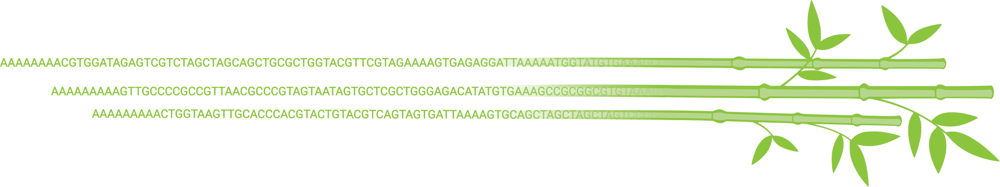

# bambu: reference-guided transcript discovery and quantification for long read RNA-Seq data


[](https://github.com/GoekeLab/bambu/releases/)
[](https://github.com/GoekeLab/bambu/graphs/contributors)
[](#installation)
[](https://www.gnu.org/licenses/gpl-3.0)
[](https://doi.org/10.5281/zenodo.3900025)


***bambu*** is a R package for multi-sample transcript discovery and quantification using long read RNA-Seq data. You can use ***bambu*** after read alignment to obtain expression estimates for known and novel transcripts and genes. The output from ***bambu*** can directly be used for visualisation and downstream analysis such as differential gene expression or transcript usage.


---

### Content

  - [Installation](#installation)
  - [General usage](#general-usage)
  - [Use precalculated annotation objects](#use-precalculated-annotation-objects)
  - [Advanced options](#advanced-options)
  - [Complementary functions](#complementary-functions)
  - [Release History](#release-history)
  - [Citation](#citation)
  - [Contributors](#contributors)


### Installation

You can install ***bambu*** from github:

```rscript
if (!requireNamespace("devtools", quietly = TRUE))
    install.packages("devtools")
devtools::install_github("GoekeLab/bambu")
```
---

### General Usage 

The default mode to run ***bambu** is using a set of aligned reads (bam files), reference genome annotations (gtf file, TxDb object, or bambuAnnotation object), and reference genome sequence (fasta file or BSgenome). ***bambu*** will return a summarizedExperiment object with the genomic coordinates for annotated and new transcripts and transcript expression estimates: 
 
 ```rscript
library(bambu)

test.bam <- system.file("extdata", "SGNex_A549_directRNA_replicate5_run1_chr9_1_1000000.bam", package = "bambu")
  

se <- bambu(reads = test.bam, annotations = "TxDb.Hsapiens.UCSC.hg38.knownGene", genomeSequence = "BSgenome.Hsapiens.NCBI.GRCh38")
       
```


We highly recommend to use the same annotations that were used for genome alignment. If you have a gtf file and fasta file you can run ***bambu*** with the following options:

```rscript
test.bam <- system.file("extdata", "SGNex_A549_directRNA_replicate5_run1_chr9_1_1000000.bam", package = "bambu")
  
fa.file <- system.file("extdata", "Homo_sapiens.GRCh38.dna_sm.primary_assembly_chr9_1_1000000.fa", package = "bambu")

gtf.file <- system.file("extdata", "Homo_sapiens.GRCh38.91_chr9_1_1000000.gtf", package = "bambu")

bambuAnnotations <- prepareAnnotationsFromGTF(gtf.file)

se <- bambu(reads = test.bam, annotations = bambuAnnotations, genomeSequence = fa.file)

```


**Quantification of annotated transcripts and genes only (no transcript/gene discovery)**

```rscript
bambu(reads = test.bam, annotations = txdb, genomeSequence = fa.file, extendAnnotations = FALSE)
```

**Large sample number/ limited memory**     
For larger sample numbers we recommend to write the processed data to a file:

```rscript
bambu(reads = test.bam, readClass.outputDir = "./bambu/", annotations = bambuAnnotations, genomeSequence = fa.file)
```
---


### Use precalculated annotation objects

You can also use precalculated annotations.

If you plan to run ***bambu*** more frequently, we recommend to save the bambuAnnotations object.

The bambuAnnotation object can be calculated from a *.gtf* file:

```rscript
annotations <- prepareAnnotationFromGTF(gtf.file)
```

From *TxDb* object

```rscript
annotations <- prepareAnnotations(txdb)
```

---

### Advanced Options

**More stringent filtering thresholds imposed on potential novel transcripts**    
 
- Keep novel transcripts with min 5 read count in at least 1 sample: 

```rscript
bambu(reads, annotations, genomeSequence, isoreParameters = list(min.readCount = 5))
```

- Keep novel transcripts with min 5 samples having at least 2 counts:

```rscript
bambu(reads, annotations, genomeSequence, isoreParameters = list(min.sampleNumber = 5))
```

- Filter out transcripts with relative abundance within gene lower than 10%: 

```rscript
bambu(reads, annotations, genomeSequence, isoreParameters = list(min.readFractionByGene = 0.1))
```

**Quantification without bias correction**     

 The default estimation automatically does bias correction for expression estimates. However, you can choose to perform the quantification without bias correction.

```rscript
bambu(reads, annotations, genomeSequence, emParameters = list(bias = FALSE))
```

**Parallel computation**      
 ***bambu***  allows parallel computation.  

```rscript
bambu(reads, annotations, genomeSequence, ncore = 8)
```

See [manual](docs/bambu_0.3.0.pdf) for details to customize other conditions.

---

### Complementary functions

**Transcript expression to gene expression**

```rscript
transcriptToGeneExpression(se)
```

**Visualization**

 You can visualize the novel genes/transcripts using ***plot.bambu*** function 

```rscript
plot.bambu(se, type = "annotation", gene_id)

plot.bambu(se, type = "annotation", transcript_id)
```

- ***plot.bambu*** can also be used to visualize the clustering of input samples on gene/transcript expressions

```rscript
plot.bambu(se, type = "heatmap") # heatmap 

plot.bambu(se, type = "pca") # PCA visualization
```

- ***plot.bambu*** can also be used to visualize the clustering of input samples on gene/transcript expressions with grouping variable

```rscript
plot.bambu(se, type = "heatmap", group.var) # heatmap 

plot.bambu(se, type = "pca", group.var) # PCA visualization
```

**Write bambu outputs to files**

- ***writeBambuOutput*** will generate three files, including a *.gtf* file for the extended annotations, and two *.txt* files for the expression counts at transcript and gene levels.

```rscript
writeBambuOutput(se, path = "./bambu/")
```
---

### Release History

**bambu version 0.3.0**
Release date: 28th July 2020

**bambu version 0.2.0**

Release date: 18th June 2020

**bambu version 0.1.0**

Release date: 29th May 2020

### Citation
A manuscript describing bambu  is currently in preparation. If you use bambu for your research, please cite using the following doi: 10.5281/zenodo.3900025. 

### Contributors

This package is developed and maintained by [Ying Chen](https://github.com/cying111), [Yuk Kei Wan](https://github.com/yuukiiwa), and  [Jonathan Goeke](https://github.com/jonathangoeke) at the Genome Institute of Singapore. If you want to contribute, please leave an issue. Thank you.


